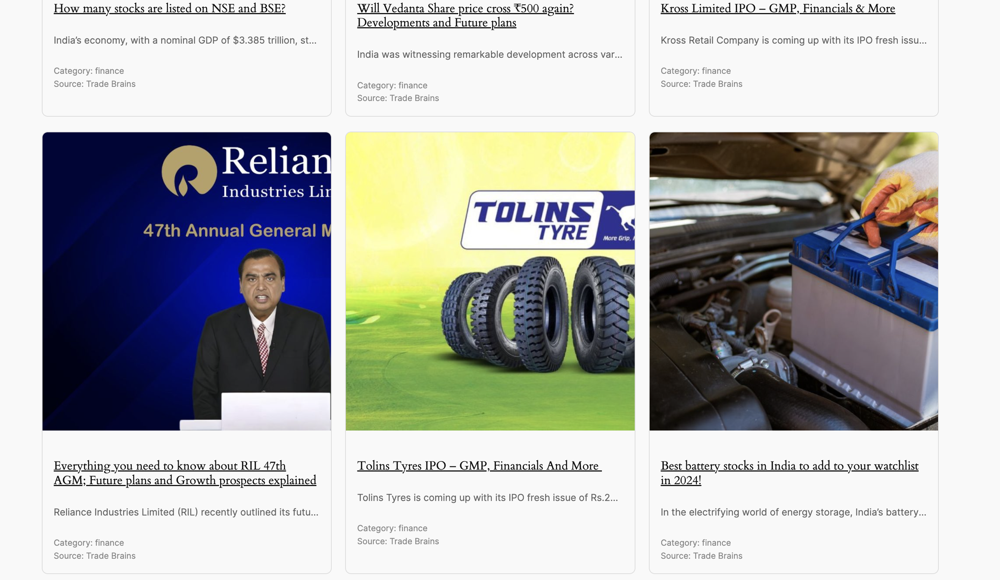

# Advanced RSS Feed Manager

## Description
The **Advanced RSS Feed Manager** is a WordPress plugin designed for bulk importing RSS feeds, pagination, and displaying feeds with images in a card view. This open-source project allows users to manage and display RSS feeds easily.

## Features
- Bulk import of RSS feeds
- Pagination support
- Display feeds with images in a card view
- Customizable settings for fallback images and refetch intervals

## Installation
1. Download the plugin files.
2. Upload the `advanced_rss_feed_manager` folder to the `/wp-content/plugins/` directory.
3. Activate the plugin through the 'Plugins' menu in WordPress.
4. Configure the settings under the 'RSS Feed Manager' menu in the WordPress admin.

## Usage
To display RSS feeds on a page or post, use the following shortcode:
```
[display_rss_feeds feeds="Feed Name, Feed URL, Category"]
```
- Replace `Feed Name`, `Feed URL`, and `Category` with your desired values.
- You can also set the number of items per page and the current page using the `per_page` and `paged` attributes.

### Images
- **Plugin UI in Admin Panel**:
  

- **How to Use Shortcode**:
  

- **Plugin UI in Effect**:
  

## Contributing
Contributions are welcome! Feel free to fork the repository and submit a pull request.

## License
This project is open-source and available under the [MIT License](LICENSE).

## Donations
If you appreciate this project and would like to support its development, you can donate using the following cryptocurrency wallet:

- **Ethereum**: `0x3B03F63D7D27e2b0609306e8439Cda48ED09e95a`

Thank you for your support!
